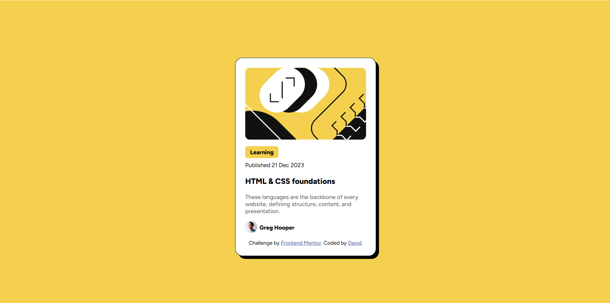

# Frontend Mentor - Blog preview card solution

## Table of contents

- [Overview](#overview)
  - [The challenge](#the-challenge)
  - [Screenshot](#screenshot)
  - [Links](#links)
- [My process](#my-process)
  - [Built with](#built-with)
  - [What I learned](#what-i-learned)
  - [Continued development](#continued-development)
  - [Useful resources](#useful-resources)
- [Author](#author)

## Overview

### Screenshot




### Links

- Solution URL: [Github Repository](https://github.com/davidobeng200/blog-preview-card-main)
- Live Site URL: [Git Pages](https://davidobeng200.github.io/blog-preview-card-main/)

## My process

### Built with

- Semantic HTML5 markup
- CSS properties
- Flexbox


### What I learned

In the development process, I tried to resize the main image which as a result created a padding-like empty areas at the top and the bottom of the image by default. I learned how to better fit image into its parent container without causing such issue.


```html
<div class="illustration-article">
      
</div>
```
```css
.illustration-article img{
      height: 100%;
      width: 100%;
      box-sizing: border-box;
      border-radius: 10px;
      margin-bottom: 10px;
    }

```


### Continued development

Better responsive positioning of multiple elements


### Useful resources

- [Example resource 1](https://www.w3schools.com/css/css3_shadows_box.asp) - This helped me on box shadow.


## Author

- Website - [DAVID OBENG ADJEI](https://www.your-site.com)
- Frontend Mentor - [@davidobeng200](https://www.frontendmentor.io/profile/davidobeng200)
